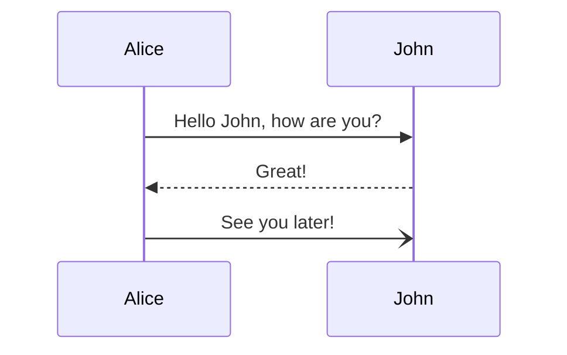

# 一级标题

正文

# 一级标题

## 二级标题

正文

### 三级标题

正文

### 三级标题 $\frac{1}{2}$

#### 四级标题

正文

#### 四级标题 `code`

##### 五级标题

正文

###### 六级标题

正文

正文 **加粗** ==高亮== 公式 $\frac{1}{2}$ ~~这是删除线~~`行内代码`
正文 **加粗** ==高亮== 公式 $\frac{1}{2}$ ~~这是删除线~~`行内代码`

- 正文 **加粗**  公式 $\frac{1}{2}$ ~~这是删除线~~`行内代码`
- 正文 **加粗**  公式 $\frac{1}{2}$ ~~这是删除线~~`行内代码`
    - 正文 **加粗**  公式 $\frac{1}{2}$ ~~这是删除线~~`行内代码`
    - 正文 **加粗**  公式 $\frac{1}{2}$ ~~这是删除线~~`行内代码`

1. - 正文 **加粗** ==高亮== 公式 $\frac{1}{2}$
2. - 正文 **加粗** ==高亮== 公式 $\frac{1}{2}$


`行内代码`
`行内代码`

```python
print(123)
print(123)
print(123)
print(123)
print(123)
for i in range(10):
    print(i)
```

$$
\frac{1}{2}
$$

> 引用
正文 **加粗** ==高亮== 公式 $\frac{1}{2}$ ~~这是删除线~~`行内代码`
正文 **加粗** ==高亮== 公式 $\frac{1}{2}$ ~~这是删除线~~`行内代码`


